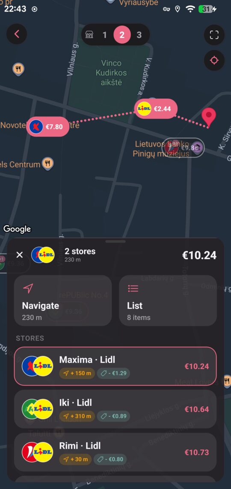

# souply-api

Backend for [Souply](https://souply.lt), a grocery price comparison service for the
Lithuanian market. It scrapes five supermarket chains, turns photographed receipts into
structured line items, decides which products from different shops are the same thing, and
answers the question the product exists to answer: what would this basket cost at each shop
near me?

About 71,000 lines of TypeScript across 321 files, 137 test suites, 85 migrations.

| Repo | Role |
|---|---|
| **`souply-api`** | this one: Node, Express, MariaDB |
| [`souply-app`](https://github.com/mantasmisiun/souply-app) | React Native client |
| [`souply-web`](https://github.com/mantasmisiun/souply-web) | web client |
| [`souply-shared`](https://github.com/mantasmisiun/souply-shared) | receipt parsers, shared with the app |

---

## The constraint everything else follows from

No Lithuanian chain publishes a barcode. One exposes an `eans` field, empty in every record I
sampled. There's no shared identifier, no API, and no agreement between chains on how to
write a product name:

```
Rimi   "DVARO natural milk, 3,5 % fat"
IKI    "Natural DVARO milk, 3,5% fat"
Norfa  "Natural DVARO milk, 3,5% fat"
```

So the join key has to be manufactured. Most of the interesting code here exists because of
that.

---

## Matching


`matchScrapedProduct` scores a candidate on name similarity, size, unit family and price
plausibility, then either links it to an existing product or mints a new one. The screenshot
is that decision rendered: six store products, three chains, four pack sizes, one canonical
product.

Two rules came out of failures. Numbers disambiguate rather than decorate, so 2.5% and 3.5%
milk are separate products and a size mismatch subtracts from the score. And matching is
zero-fallback: under the threshold, an item stays unmatched, because a confidently wrong
match is worse than a gap.

Confidence is never total, so anything ambiguous goes to a human queue served by
`slot1/2/3CandidateModel`. Users answer identical, similar, different or skip. `Similar` is
the one that pays off twice: it deduplicates the catalogue and builds the substitution graph
that lets the basket calculator offer a cheaper equivalent.

<br clear="right">

## Pricing and the basket calculator

`0.5 l` from Rimi and `500 ml` from IKI are the same quantity written two ways. Size parsing
reconciles the notation, and everything downstream compares per kilogram or per litre, which
is the only way a 2 l carton and a 500 ml one can be ranked honestly.



The split-basket search is a hybrid, because its two halves have different structure.

Choosing which stores to visit is exhaustive over every combination of size *k*. Adding a
store changes what every item costs, so those choices are coupled and a greedy walk can pick
badly.

Choosing which store supplies each item, once the set is fixed, is greedy, and greedy is
provably optimal at that point. The per-item choices are independent: taking the cheapest
milk cannot make the bread dearer.

`nearestPool` caps candidates per chain and by radius before any of this runs, which keeps
`C(n,k)` small enough to brute-force. A viability filter then drops splits that aren't worth
the trip, using an absolute saving floor and a euros-per-kilometre rate together.

<br clear="right">

## Receipt pipeline


OCR runs on the phone. The API receives text with geometry and does the reconstruction, using
per-chain parsers from `souply-shared`.

The hard part is that a Lithuanian receipt prints a discount as a separate negative line,
sometimes several lines after the product, sometimes glued onto the next product's text by
bad OCR. Attribution is handled by treating a band border as a hard wall that content never
crosses.

Approaches that look obvious and fail: sorting fragments by x (breaks on skew), attaching
prices by nearest y (breaks on curved paper). Both fail by producing plausible wrong data,
which is why the parsers refuse rather than guess. A weighed item whose price per kilo can't
be recovered is stored with a price of 0 and a null unit price, never a fabricated number.

Matched receipt lines feed price history, which makes receipts a second source of truth
alongside the scrapers, and one that records what a till actually charged.

<br clear="right">

## Scrapers

Five chains on a weekly schedule set by when each one announces its offers. Two transports,
chosen by measurement rather than habit:

- Rimi, Norfa and IKI serve their promotional data in the initial HTML response, so a plain
  fetch and cheerio is enough.
- Barbora and Lidl render theirs client-side and need a real browser.

Lidl additionally publishes a weekly leaflet as a vector-text PDF, which `pdftohtml -xml`
turns into positioned boxes. Some fresh-food offers appear only there.

A representative run: IKI 3,281 promotions found, Rimi 5,037, roughly half of each already
current and skipped. Prices fan out across 795 stores.

### A known weakness

Scrapers can fail silently. In one measured session, Lidl category discovery returned 101
URLs, then 0, then an error, all exiting cleanly, and the leaflet parser read 43 pages and
extracted nothing while reporting success. Stale promotions stay on screen until they expire,
and nothing raises an alarm.

Being fixed by a floor check against the previous run, alert messages that separate what was
found from what was written, and splitting Lidl discovery from pricing. Discovery works over
plain HTTP; only the price layer needs a browser, so a rendering hiccup shouldn't cost the
catalogue too.

---

## Two pieces of the schema worth reading

`config/db.ts` carries the scars of two production incidents and explains both in comments.

MariaDB has no native JSON type. `JSON` is `LONGTEXT` with a check constraint, so columns
built with `JSON_ARRAYAGG` come back as strings, occasionally double-encoded. That's
normalised once in the pool's `typeCast` hook instead of at a thousand call sites.

The connection charset is pinned to `utf8mb4` because mysql2 defaults the connection to
three-byte `utf8mb3`. An emoji in a basket name was silently mangled in transit, which
corrupted the JSON, which failed a `json_valid` constraint, which rejected the insert. Three
layers between symptom and cause.

Household expense sharing is an append-only event ledger. Balances are derived by folding
events rather than stored, everything is integer cents, and each event's shares are
materialised at write time so entries sum to zero by construction. A balance cannot drift out
of step with its history.

---

## Stack

- TypeScript 6 on Express 5, native ESM
- MariaDB through `mysql2/promise`, raw SQL, no ORM
- MinIO for receipt images, `jose` for JWTs including Google and Apple JWKS verification
- `node-cron` for the scrape schedule
- Playwright with stealth, and cheerio, for the two scraping strategies
- Jest and supertest, 137 suites
- Sentry, helmet, compression, swagger-jsdoc

Raw SQL is deliberate. The workload is analytical: cross-chain comparison, aggregation across
stores, matching. Those are queries worth reading and tuning directly, and an ORM mostly gets
in the way of that. The cost is owning correctness by hand, which is covered by parameterised
queries everywhere and by keeping SQL out of controllers.

---

## Layout

```
src/
  index.ts        express bootstrap and middleware chain
  config/         db pool, MinIO client, env loader, swagger
  middleware/     auth, resource authorization, rate limit, locale, version gate
  routes/         one file per resource group
  controllers/    thin: request -> service -> response
  services/       basket calc, matching, ledger, OAuth, receipt processing
  models/         raw SQL and row mappers
  scrapers/       per-chain scrapers, leaflet parser, cron scheduler
  scripts/        operational CLIs
  utils/          matching helpers, name parsing

sql/              85 migrations, applied in order
tests/            137 suites, mostly integration through supertest
```

The `scripts/` directory is larger than usual and is the operational surface:
`receipts:matchaudit` diffs match quality against a baseline, `receipts:reparse` replays
stored OCR without a phone, `scraperDryRun` writes what a scrape would persist to CSV for
review before anything touches the database.

---

## Running it

```bash
npm install
cp .env.example .env      # DB, MinIO and OAuth values
npm run dev               # nodemon + tsx
```

```bash
npm run build             # tsc -> dist/
npm test                  # jest; needs a test database, see tests/schema/README.md
npx tsc --noEmit
```

```bash
npm run scrape:all        # or :rimi :iki :barbora :norfa :lidl
npm run receipts:batch    # import and parse a staged receipt batch
npm run admin             # moderation CLI
```

CI runs typecheck, build and the full suite on every push and pull request against a MariaDB
service container. It checks out `souply-shared` alongside this repo and pins it to the same
environment branch as the run, so a pull request into staging is tested against staging's
parsers rather than main's.

Branches are `dev`, `staging`, `main`, promoted by pull request. Commits follow Conventional
Commits, enforced by commitlint through husky.

---

## Status

Actively developed and deployed. Published so the work can be read, not accepting
contributions, no open-source licence granted, all rights reserved.

The receipt corpus used for parser regression testing is deliberately absent from this
repository. It's made of real receipts, which are personal data.
